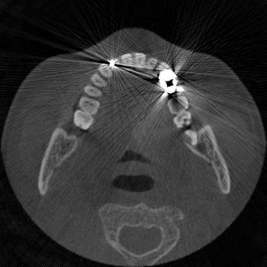
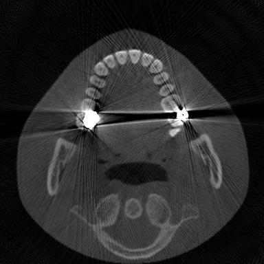
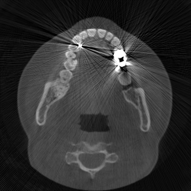

<div align="center">

# RefineFlow-MAR: Physics-Guided Unsupervised CBCT Metal Artifact Reduction

<p>
  
  
  
  
</p>

<p>
  <b>Paper:</b> Manuscript &nbsp;|&nbsp;
  <b>Task:</b> Dental CBCT Metal Artifact Reduction
</p>

RefineFlow-MAR learns an anatomical rectified-flow prior from unpaired clean
CBCT and couples it with continuous projection-domain physical guidance.

</div>

---

## Visual Results

The moving divider reveals the RefineFlow-MAR reconstruction on the left while
retaining the metal-affected input on the right.

<table>
  <tr>
    <th align="center">Case 1</th>
    <th align="center">Case 2</th>
    <th align="center">Case 3</th>
  </tr>
  <tr>
    <td align="center"></td>
    <td align="center"></td>
    <td align="center"></td>
  </tr>
</table>

## Highlights

- **Unpaired anatomical prior:** learns the clean CBCT distribution without
  requiring paired metal-corrupted and artifact-free scans.
- **Continuous physics guidance:** injects reliability-masked Radon-domain
  gradients throughout the rectified-flow trajectory instead of applying a
  single hard projection correction.
- **Risk-aware refinement:** combines gradient correction near unreliable
  regions with sinogram replacement in reliable anatomy.
- **Dual-domain consistency:** balances artifact suppression, anatomical
  plausibility, and fidelity to the measured projections.

## Repository Layout

```text
RefineFlow-MAR/
|-- assets/demos/                         # Animated visual comparisons
|-- config/
|   |-- MAR_pnp_rf.yaml
|   |-- MAR_pnp_rf_clinical.yaml
|   `-- train_JiT_B16_1ch_rf_fp32_cbct.yaml
|-- data_dependancy/metal_masks/
|-- geometry/
|   |-- build_gemotry.py
|   `-- syndeeplesion_data.py
|-- model/
|   `-- README.md                       # Checkpoint availability
|-- patch_diffusion/
|   |-- pnp_rf_mar.py                   # DPS-RF solver and refinement
|   `-- jit/                            # JiT model definitions
|-- test_data/
|   |-- gtdata/
|   `-- oral_ct/                        # Included synthetic test data
|-- test_results_dps_rf/                 # Included example outputs
|-- utils/
|-- mar_pnp_rf.py                        # DPS-RF inference entry point
|-- generate_pair_data.py                # Synthetic-data generation
|-- train_rectified_flow.py               # Rectified-flow training
|-- inspect_h5_data.py
|-- inspect_h5_hu.py
|-- calculate_psnr_ssim.py
|-- requirements.txt
|-- LICENSE
`-- README.md
```

The directory name `data_dependancy` is retained for compatibility with the
existing project layout.

## Environment

The intended pipeline requires Linux, an NVIDIA GPU, and a working CUDA
toolchain. It uses both Torch Radon and the ODL `astra_cuda` backend.

Recommended prerequisites:

- A Python version supported by the selected PyTorch/CUDA combination.
- CUDA-enabled PyTorch and a matching `torchvision` version.
- CUDA Toolkit (`nvcc`), a C/C++ compiler, and Git.
- The packages listed in [requirements.txt](requirements.txt).

Install PyTorch first using the command appropriate for the server CUDA
version, then install the remaining requirements:

```bash
# Example only: choose the PyTorch command for the target CUDA version.
python -m pip install torch torchvision
python -m pip install -r requirements.txt
```

`torch-radon` is installed from a pinned Git commit and builds a CUDA
extension.

Most package versions are intentionally not pinned because CUDA servers
require compatible PyTorch, torchvision, compiler, and driver combinations.
For strict reproduction, record the working server environment with
`python -m pip freeze` and the CUDA/PyTorch version information.

## Training

Training uses the single-channel `JiT-B/16` model, FP32 arithmetic, a
rectified-flow x-prediction objective, dual EMA parameters, and a
linear-warmup/cosine-decay learning-rate schedule. The configuration is
[config/train_JiT_B16_1ch_rf_fp32_cbct.yaml](config/train_JiT_B16_1ch_rf_fp32_cbct.yaml).

Set `data_dir` in the configuration or override it on the command line:

```bash
CUDA_VISIBLE_DEVICES=0 python train_rectified_flow.py \
    --config ./config/train_JiT_B16_1ch_rf_fp32_cbct.yaml \
    --data_dir /path/to/training/images
```

Resume training with:

```bash
CUDA_VISIBLE_DEVICES=0 python train_rectified_flow.py \
    --config ./config/train_JiT_B16_1ch_rf_fp32_cbct.yaml \
    --resume ./runs/jit_b16_1ch_rf_fp32_cbct/checkpoint-last.pth
```

## Model Checkpoint

Place the pretrained checkpoint at:

```text
model/checkpoint-step0240000.pth
```

Checkpoint files are ignored by Git. See [model/README.md](model/README.md).

## Included Synthetic Data

The repository contains one synthetic test image combined with ten metal masks:

```text
test_data/oral_ct/
|-- testmask.npy
|-- test_720geo_dir.txt
`-- test_720geo/
    `-- patient_0000/000/
        |-- gt.h5
        |-- 0.h5
        |-- 1.h5
        |-- ...
        `-- 9.h5
```

The H5 datasets use these fields:

- `gt.h5`: artifact-free image stored as `image`.
- `0.h5` through `9.h5`: `ma_CT`, `ma_sinogram`, `LI_CT`,
  `LI_sinogram`, and `metal_trace`.
- `testmask.npy`: image-domain metal masks with shape `H x W x N`.
- `test_720geo_dir.txt`: relative paths to ground-truth H5 files.

The included H5 files use the anonymous identifier `patient_0000` and do not
contain patient or author attributes. Users are responsible for any replacement
data they provide.

## Inference

Configure these fields in `config/MAR_pnp_rf.yaml` for the target server:

```yaml
model_path: /path/to/checkpoint-step0240000.pth
data_path: /path/to/test_data/oral_ct
save_dir: ./test_results_dps_rf
```

Run inference with:

```bash
CUDA_VISIBLE_DEVICES=0 python mar_pnp_rf.py \
    --config ./config/MAR_pnp_rf.yaml
```

Important configuration options include:

| Option | Meaning |
| --- | --- |
| `model_name` | JiT model registry key; the default is `JiT-B/16`. |
| `image_size` | Reconstruction image size; included data uses `512`. |
| `num_steps` | Number of rectified-flow integration steps. |
| `sampling_method` | `euler` or `heun`. |
| `grad_mode` | `full` guidance gradient or lower-memory `approx`. |
| `init_mode` | `noise` or `xli_blend`. |
| `final_refine_mode` | `none`, `sino_replace`, `gradient_dc`, or `hybrid_mask`. |
| `hybrid_mask_mode` | `original` or `projection_augmented`. |

## Synthetic Data Generation

The generator produces DuDoDp-compatible H5 pairs using a
polychromatic projection model, beam-hardening correction, material
attenuation tables, and ODL/ASTRA fan-beam geometry.

Set `clean_dir`, `bad_dir`, and `output_dir` in `generate_pair_data.py`, then
run:

```bash
python generate_pair_data.py
```

## H5 Inspection

The inspection utilities are included and can read the packaged H5 files:

```bash
python inspect_h5_data.py \
    test_data/oral_ct/test_720geo/patient_0000/000/9.h5 \
    --save-png \
    --output-dir ./h5_inspection_output
```

For HU-window visualization:

```bash
python inspect_h5_hu.py \
    test_data/oral_ct/test_720geo/patient_0000/000/9.h5 \
    --save-png \
    --output-dir ./h5_hu_output
```

Useful options include `--bit-depth 8`, `--bit-depth 16`, `--show-plot`,
`--hu-min`, `--hu-max`, and `--no-hu-window`.

## Evaluation

`calculate_psnr_ssim.py` computes PSNR and SSIM for PNG results. Set its
`gt_path` and `results_path` variables to the desired directories before
running:

```bash
python calculate_psnr_ssim.py
```

It supports one-to-one matching when result and GT counts are equal, and
many-to-one matching when multiple results share one GT.

## Clinical Data Format

`config/MAR_pnp_rf_clinical.yaml` documents the clinical H5 layout expected
by the loader:

```text
<clinical_data_root>/
|-- testmask.npy
|-- test_720geo_dir.txt
`-- test_720geo/
    `-- patient_XXXX/000/<image>.h5
```

Clinical H5 files should contain `ma_CT`, `ma_sinogram`, `LI_CT`,
`LI_sinogram`, and `metal_trace`. Clinical mode does not require ground
truth.

## Reproducibility Notes

- YAML files contain example server paths and must be updated for another
  server.
- CUDA-backed projection components are initialized during pipeline startup.
- `grad_mode: full`, 512 x 512 images, and long refinement runs can require
  substantial GPU memory.
- The packaged outputs are examples associated with the included synthetic
  data, not a complete benchmark report.
## Citation

The associated paper has not yet been published. Citation metadata and BibTeX
will be added after publication.

## License

RefineFlow-MAR is released under the
[GNU General Public License v3.0](LICENSE).

Copyright (C) 2026 RefineFlow-MAR authors.
